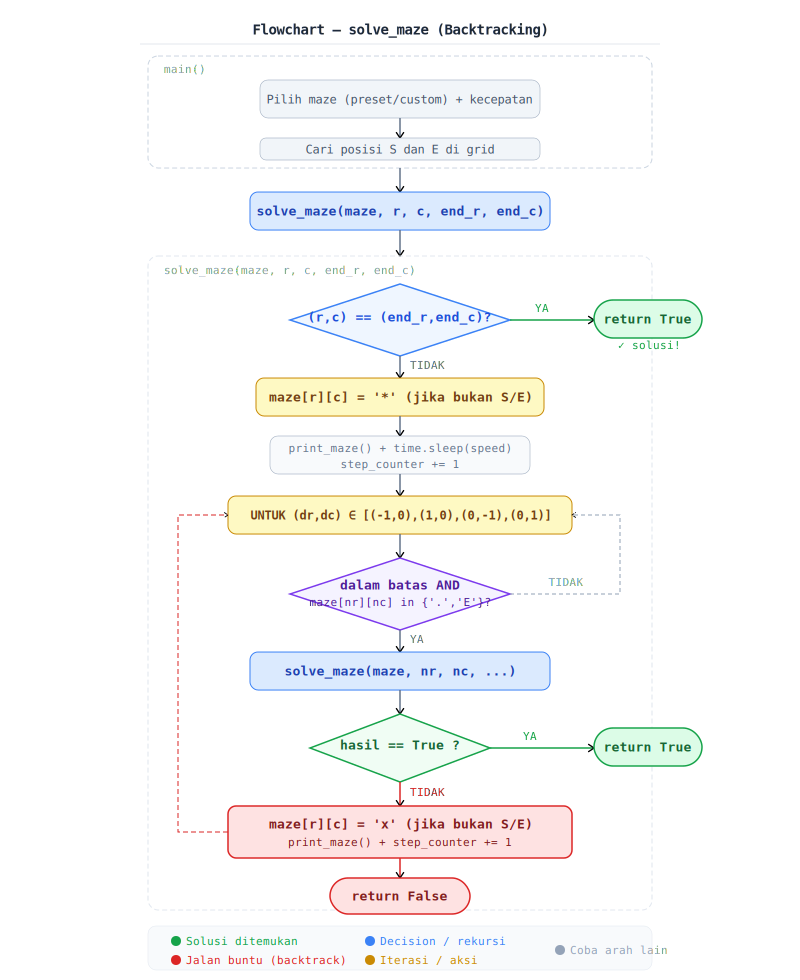

# Maze Solver — Backtracking Algorithm

Implementasi algoritma **Backtracking** untuk menyelesaikan labirin dengan visualisasi animasi langkah demi langkah di terminal.

---

## Cara Kerja Algoritma

Program menjelajahi labirin secara rekursif. Dari posisi saat ini, ia mencoba bergerak ke 4 arah (atas, bawah, kiri, kanan). Jika semua arah tertutup, ia mundur (*backtrack*) ke posisi sebelumnya dan mencoba arah lain.

---

## Pseudocode

```
FUNGSI solve_maze(maze, r, c, end_r, end_c):

    JIKA (r, c) == (end_r, end_c):
        return True                    ← Base case: tujuan tercapai

    tandai maze[r][c] = '*'            ← Sedang dijelajahi
    tampilkan animasi

    UNTUK SETIAP (dr, dc) DALAM [(−1,0),(1,0),(0,−1),(0,1)]:
        nr = r + dr
        nc = c + dc

        JIKA dalam batas grid DAN maze[nr][nc] ∈ {'.', 'E'}:
            JIKA solve_maze(maze, nr, nc, end_r, end_c) == True:
                return True            ← Solusi ditemukan

    ← Semua arah gagal → backtrack
    tandai maze[r][c] = 'x'
    tampilkan animasi
    return False
```

---

---

## Flowchart Sistem

Berikut adalah alur logika dari fungsi `solve_maze` menggunakan pendekatan rekursif:



---

## Representasi Maze

Maze direpresentasikan sebagai grid karakter 2D:

| Karakter | Arti |
|----------|------|
| `S` | Titik start |
| `E` | Titik end / tujuan |
| `#` | Tembok (tidak bisa dilewati) |
| `.` | Jalur kosong (bisa dilewati) |
| `*` | Sedang dijelajahi (jalur aktif) |
| `x` | Jalan buntu (sudah di-backtrack) |

Contoh maze Easy (5×5):

```
S...#
###.#
#...#
#.###
#...E
```

---

## Cara Menjalankan

```bash
python maze_solver.py
```

Tidak ada library eksternal yang dibutuhkan.

### Menu Program

**1. Pilih Kompleksitas:**
```
[1] Mudah  — 5×5
[2] Sedang — 9×9
[3] Sulit  — 13×13
[4] Custom — input sendiri
```

**2. Pilih Kecepatan Animasi:**
```
[1] Cepat   — 0.05 detik/langkah
[2] Normal  — 0.2  detik/langkah
[3] Lambat  — 0.5  detik/langkah
```

### Format Custom Maze

```
S...#
###.#
#...E
DONE
```

Ketik `DONE` di baris baru setelah selesai memasukkan maze.

---

## Kompleksitas

| | Nilai |
|-|-------|
| Time | O(RxC) worst case |
| Space | O(R×C) untuk rekursi stack |

> R = jumlah baris, C = jumlah kolom
